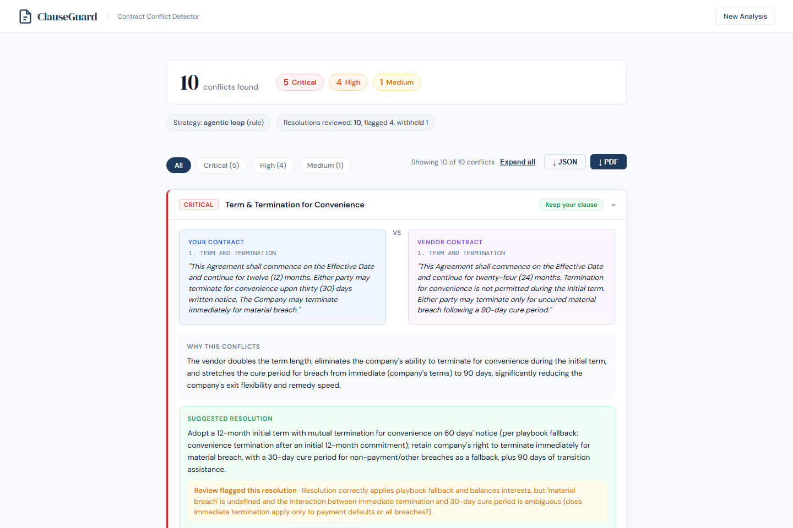

# ClauseGuard, Contract Conflict Detector

[](./LICENSE)
[](./requirements.txt)
[](./config.py)
[](./.github/workflows/ci.yml)



*The recorded demo (`CLAUSEGUARD_DEMO=1`, no API key): the brief for the two sample contracts, with the second-model review flagging where a suggested resolution is still ambiguous.*

An agentic contract-review system that ingests two contract PDFs, extracts the clauses, surfaces material conflicts side-by-side, and produces a risk-ranked redline brief with suggested compromise language. Version 0.3 is the **eval-driven rewrite**: the June 2026 eval showed the two-tool agentic loop and a single prompt were equivalent in aggregate but split by tier, so the system now routes each contract pair to the cheaper architecture that wins on its shape, retrieves negotiation positions from a playbook through a third tool, validates every conflict against a strict schema, reviews every suggested resolution with a second model, and traces cost per analysis. It ships as one Docker image with a demo-replay mode.

**[Run guide](./RUN_GUIDE.md)** · **[Eval harness](./eval/README.md)**

> **Status:** runs end-to-end against the Anthropic API, container-packaged, browser-verified. *Decision support for contract review, not a substitute for a lawyer.*

---

## The problem

A mid-market company receives a vendor's redlined Master Services Agreement at 4:47 PM on a Friday with a signature wanted by Monday. Inside are 80+ clauses. Tracked changes show *where* the language differs from the company's standard terms; they do not say which differences are material (liability caps, indemnification scope, IP ownership, termination rights) and which are noise.

ClauseGuard automates that first hour of clause triage into a redline brief a paralegal or junior attorney can hand to senior counsel. It does **not** finalize the contract, draft the response, or replace legal review.

---

## What this proves (AI Engineer signals)

| Signal | Where it shows up |
|---|---|
| **Routing built, measured, and demoted** | A rule pre-router (shared CRITICAL topics) plus a Haiku classifier sends each pair to the agentic loop or a single structured call. The September eval's `routed` branch showed it only matches the single prompt, so it ships as an opt-in cost lever (`CLAUSEGUARD_ROUTING=auto`), not the default. [`backend/router.py`](./backend/router.py). |
| **Retrieval as a tool, measured** | A 24-entry negotiation playbook (BM25 with topic aliases) is exposed as `lookup_playbook`; conflicts cite a `playbook_ref`. The eval runs it both as an agent tool (`full_rag`) and inlined into the single prompt (`stripped_rag`) and shows the inlined form *hurts* (−19pp F1) while the tool form is neutral. [`backend/playbook.py`](./backend/playbook.py). |
| **Strict structured outputs with repair** | Each conflict is validated against a Pydantic schema (`additionalProperties: false`); invalid items are returned to the model with the error list for one repair round. Repairs are counted on the trace. [`backend/schemas.py`](./backend/schemas.py). |
| **LLM-as-judge on the risky output, calibrated** | A Haiku judge reviews every suggested resolution for soundness, one-sidedness, ambiguity and citation validity; unsound resolutions are withheld or flagged in the UI. 12 hand-labelled cases give 67% exact agreement and 100% safe-side (the judge never passes something labelled flag/hide). [`backend/judge.py`](./backend/judge.py), `eval/judge_calibrate.py`. |
| **Untrusted-input defence** | Clauses are rendered as tagged data, injection patterns are flagged per clause, and optional PII redaction replaces emails, phones, SSNs, cards and IBANs with stable tokens before text leaves the process. [`backend/sanitize.py`](./backend/sanitize.py). |
| **Observability and ceilings** | Per-analysis trace (calls, tokens, cache reads, USD, latency per stage), a token ceiling, prompt caching on the system prompt, hash-chained append-only audit log verified on `/health`, optional OpenTelemetry export. [`backend/telemetry.py`](./backend/telemetry.py). |
| **Real-world inputs** | Tesseract OCR for scanned PDFs, a governing-law selector that becomes analysis context, 10 MB / 120-clause caps. [`backend/tools.py`](./backend/tools.py). |
| **Tested without the network** | 260 tests, including the whole pipeline on a fake client, the FastAPI surface, OCR path, judge parsing, audit chain. CI runs lint, tests, regression gate, frontend build and a Docker demo smoke test. |

---

## System at a glance

```
   Contract A (PDF)            Contract B (PDF)          governing law (optional)
        └──────────────┬───────────────┘                          │
                       ▼                                          │
            PDF text (+ OCR if scanned) → clause split → injection scan → PII redaction
                       ▼
            ┌─────────────────────────┐
            │ Router: rule pre-router │  shared CRITICAL topics? → agentic
            │ then Haiku classifier   │  nothing shared?         → single
            └───────────┬─────────────┘
          agentic       │        single
     ┌──────────────────┴─────────────────────┐
     ▼                                        ▼
 tool loop (Sonnet 5)                 one structured call (Sonnet 5)
   extract_clauses ×2                   clauses + playbook inlined
   lookup_playbook                      strict schema, one repair round
   generate_redline_brief
     └──────────────────┬─────────────────────┘
                        ▼
            schema validation (repair once) → resolution judge (Haiku)
                        ▼
            SSE stream: status · route · tool · judge · trace · complete
                        ▼
            risk-ranked redline cards · review badges · playbook refs · trace footer
```

---

## Honest disclosure

1. **Two evals, and they disagree in an instructive way.** The June 2026 eval (30 scenarios × 2 branches × 3 reps, 0 errors) found FULL and STRIPPED equivalent in aggregate (64.0% vs 66.2% F1) but split by tier: the agentic loop won `severity_tiering` (+10.7pp) and the single prompt won `ambiguous` (+13.0pp). That finding produced the router.

   The September 2026 eval re-runs five branches on Sonnet 5: 30 scenarios × 5 branches × 3 reps = 450 runs, all scored (1,096 calls, $17.68; the run was interrupted once by an exhausted credit balance and finished with `--resume`, which is why the harness now fails fast and checkpoints). Report: `eval/reports/run_20260922_171534.md`.

   | F1, 30 scenarios × 3 reps | `full` | `stripped` | `full_rag` | `stripped_rag` | `routed` |
   |---|---|---|---|---|---|
   | overall (macro over tiers) | **78.9%** | 73.5% | 77.1% | 59.4% | 73.9% |
   | precision / recall | 74.8 / 99.0 | 68.2 / 100 | 72.0 / 99.0 | 54.5 / 87.5 | 68.8 / 97.0 |
   | `adversarial` | 81.5% | 82.2% | 76.3% | 38.5% | 73.7% |
   | `ambiguous` | 81.5% | 81.5% | 81.5% | 87.0% | 87.0% |
   | `clear_conflict` | 76.2% | 69.0% | 73.8% | 53.2% | 69.0% |
   | `clear_no_conflict` | 83.3% | 66.7% | 83.3% | 44.4% | 66.7% |
   | `severity_tiering` | 72.0% | 68.2% | 70.4% | 73.8% | 73.1% |

   Three things changed versus June. First, on Sonnet 5 the agentic loop now beats the single prompt by **+5.4pp F1**, almost entirely precision (it over-flags less on `clear_no_conflict` and `clear_conflict`), with run-to-run F1 range 0.05–0.07 on both, so the lift is outside noise. Second, the router did not earn its place: it matches the single prompt (73.9% vs 73.5%) while routing 51 of 90 decisions by rule and calling Haiku for the rest, but it never reaches the agentic loop's accuracy, so the **production default is now `CLAUSEGUARD_ROUTING=agentic`** and the router stays as an opt-in cost lever. Third, retrieval placement matters more than retrieval itself: the playbook as an agent tool is neutral (−1.8pp, 1.1 lookups per run), the playbook inlined into the single prompt is clearly harmful (−14pp, precision 54%), a concrete lesson about context stuffing. Schema repair fired 0 times in 450 runs.

2. **Judge calibration is small.** 12 labelled resolutions, 67% exact agreement, and it errs strictly toward hiding; a real calibration set needs a lawyer's labels and ≥ 50 cases.
3. **Playbook is fabricated.** 24 generic negotiation positions written for the demo, not a firm's actual playbook.
4. **"Expert contract attorney" is a persona, not a credential.** The governing-law selector adds context; it does not make the model reason about jurisdiction-specific case law.
5. **Two demo contracts.** All UI-level evidence comes from the fabricated pair in `sample_contracts/` (10 deliberate conflicts). Scenario evidence comes from the 30 hand-written eval scenarios.
6. **Single-side framing of `favor`.** Conflicts are always evaluated from the company's perspective.

---

## Cost, latency, and what an analysis looks like

The recorded demo run (`demo/sample_trace.json`, Sonnet 5 + Haiku judge, agentic route, 10 conflicts):

| | |
|---|---|
| Model calls | agent loop 4 turns, router 1, judge 10 |
| Cost | $0.25 |
| Resolution review | 5 pass · 4 flag · 1 hide |
| Playbook lookups | 1 |

The full eval averaged $0.039 per scored run across branches (agentic runs about $0.05, single-prompt runs about $0.02). Pricing assumes Sonnet 5 at $3/$15 per million tokens and Haiku 4.5 at $1/$5; edit `PRICING` in `backend/telemetry.py` if your rates differ.

---

## What went wrong along the way

**Retrieval in the wrong place hurt.** I assumed giving the model the negotiation playbook would help on every branch. Inlining the 24 positions into the single-prompt branch dropped F1 from 73.5% to 59.4%, and precision to 54%: the model started reporting conflicts wherever a playbook entry matched, whether or not the contracts disagreed. The same playbook exposed as a tool the agent can call was neutral (1.1 lookups per run, minus 1.8 points, inside noise). I had not expected the placement to matter more than the content.

**The router.** After the June eval showed the agentic loop and the single prompt winning different scenario tiers, I built a router to pick per contract pair. On Sonnet 5 it scored 73.9%, the same as the single prompt, and never reached the agentic loop's 78.9%. Before changing the default I checked the run-to-run spread: F1 varied by 0.05 to 0.07 across the three repetitions on both branches, so a 5.4-point gap is outside that band. The default is `agentic` now and the router is an opt-in cost lever. The report that forced this is `eval/reports/run_20260922_171534.md`.

**A badge that lied on every card.** The result cards showed "Your terms are stronger" on all ten conflicts, including Auto-Renewal and Non-Compete where the vendor's text is plainly stronger. I dug into the recorded report expecting a broken field and found `favor: Company` on every row, which is correct: the field asks whose clause better protects the company, and for a company's own standard terms against a vendor's proposal the answer is always the company. The label was the lie, not the model. It now reads "Keep your clause", with a tooltip that says what is being judged.

**Thirteen tool calls nobody could see.** The backend had emitted a `tool` event for every call since the first version. The front end never listened for it, so during an analysis you saw a five-step progress bar and nothing else. The tool feed is a small list; adding it took an afternoon, and it is now the part of the demo people ask about.

**Running out of credit at run 200 of 450.** The September eval stopped halfway when the API balance hit zero. The harness now checkpoints every scored run, stops on the first billing or auth error instead of retrying, and continues with `--resume`. Errored runs are excluded from the numbers and listed in the report's Completeness section.

---

## Quick start

```bash
# Docker, demo replay (no API key): API + UI on http://localhost:8000
docker build -t clauseguard . && docker run -p 8000:8000 -e CLAUSEGUARD_DEMO=1 clauseguard

# Docker, live analysis
docker run -p 8000:8000 -e ANTHROPIC_API_KEY=sk-ant-... clauseguard
```

Local development:

```bash
cp .env.example .env                              # add ANTHROPIC_API_KEY
python -m venv .venv && source .venv/bin/activate # .venv\Scripts\activate on Windows
pip install -r requirements.txt
uvicorn backend.main:app --reload --port 8000     # Terminal 1
cd frontend && npm install && npm run dev         # Terminal 2 → http://localhost:3000
```

Upload the two PDFs from `sample_contracts/`, pick a governing law, click **Analyze Contracts**, and watch the route decision, tool calls, judge verdicts and trace stream in.

CLI: `python -m backend.agent sample_contracts/company_standard_terms.pdf sample_contracts/vendor_proposed_terms.pdf --law DE --json`.

Quality gates, none of which call the model:

```bash
make test lint      # 260 tests, ruff
make regression     # latest eval snapshot vs eval/baseline.json
```

Live measurements:

```bash
make eval-small                    # 5 scenarios × 5 branches, ~$0.85
make eval                          # 30 × 5 × 3 reps, ~$15; add --resume to continue a stopped run
make judge-calibrate               # judge vs 12 labelled resolutions, ~$0.05
make record-demo                   # one analysis → demo/sample_trace.json
```

Runtime flags (see `.env.example`): `CLAUSEGUARD_ROUTING=agentic|auto|single`, `CLAUSEGUARD_JUDGE`, `CLAUSEGUARD_PLAYBOOK`, `CLAUSEGUARD_REDACT`, `CLAUSEGUARD_OCR`, `CLAUSEGUARD_TOKEN_CEILING`, `CLAUSEGUARD_DEMO`, `CLAUSEGUARD_API_KEY` (bearer token for the public endpoints).

---

## Repo structure

```
clauseguard/
├── README.md · RUN_GUIDE.md · LICENSE
├── Dockerfile · docker-compose.yml · Makefile · .github/workflows/ci.yml
├── config.py                      ← models, flags, ceilings, SYSTEM_PROMPT (lazy API-key check)
├── backend/
│   ├── pipeline.py                ← analyze(): routing, agentic/single runs, judge, trace, audit
│   ├── tools.py                   ← extract_clauses (OCR), lookup_playbook, generate_redline_brief
│   ├── router.py · judge.py · playbook.py · playbook.json
│   ├── schemas.py · sanitize.py · telemetry.py
│   ├── agent.py                   ← CLI
│   └── main.py                    ← FastAPI: /upload, /analyze SSE, /analyze/demo, /config, static UI
├── frontend/src/                  ← React: route/judge/trace pills, review badges, playbook refs
├── demo/sample_trace.json         ← recorded analysis for CLAUSEGUARD_DEMO=1
├── sample_contracts/              ← fabricated demo pair
├── eval/                          ← 30 scenarios, 5 branches, deterministic scorers, regression gate, judge calibration
├── scripts/record_demo.py
└── tests/                         ← 260 tests, no network
```

---

## License

[MIT](./LICENSE). The sample contracts and the playbook are fabricated demonstration documents; no real business agreement, vendor, or company is represented.

---

## Author

Mamadou Bassirou Diallo · MS Business Analytics & AI, UT Dallas · [LinkedIn](https://www.linkedin.com/in/mamadou9905) · [GitHub](https://github.com/bass990)
